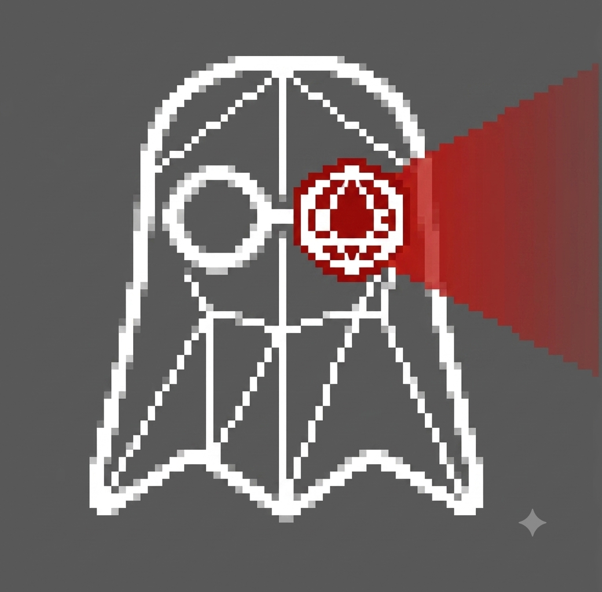

# STUKACH for Maya

Pipeline asset validator for Autodesk Maya. 44 checkers across 8 categories — topology, transforms, symmetry, UV, naming, materials, cleanup — with a per-face viewport overlay, one-click fixes, and a Qt panel that docks into Maya's UI by default.

Part of the **STUKACH — Pipeline Asset Validation System**. The Blender version lives at [abyrvalg379/STUKACH](https://github.com/abyrvalg379/STUKACH).

**Author:** Maksim Kovalev · **Version:** 1.1.0 · **License:** GPL-3.0



## Requirements

- Maya 2022+ (PySide2) or Maya 2025+ (PySide6) — built and tested on Maya 2025
- numpy, scipy (installed automatically to user site-packages by the installer)
- The bundled `stukachDrawOverride.mll` is built for **Maya 2025 / Windows x64**. For other Maya versions, compile the C++ plugin from source (see below) — the rest of the tool works without it via a display-layer fallback.

## Install (drag & drop)

1. Download `STUKACH_Maya_v1.1.0.zip` from [Releases](https://github.com/abyrvalg379/STUKACH_Maya/releases) and unpack.
2. Drag & drop `install_stukach.py` into the Maya viewport.
3. A **STUKACH** button appears on the *Custom* shelf — click it to open the panel.

The installer copies the package to `Documents/maya/2025/scripts/MAYA_STUKACH/`, the plugin to `Documents/maya/2025/plug-ins/`, and installs numpy/scipy into the Maya Python if missing.

## Checkers (36)

| Category | Checks |
|---|---|
| **Topology** | non-manifold, boundary edges, isolated verts, duplicate verts, face aspect ratio, triangles, n-gons, poles, zero-area faces, flipped normals, invalid normals, z-fighting |
| **Transforms** | non-applied transforms, non-uniform scale, construction history, origin not at zero, uncollapsed modifier stack |
| **Symmetry** | X / Y / Z (numpy grid comparison) |
| **UV** | single UV set, UDIM ready, UDIM bounds, material per UDIM, UV overlap, UV micro-shell, UV stretch, texel density, UV padding |
| **Naming** | object naming, collection naming, material numbering |
| **Materials** | material suffix, material assignment, missing textures |
| **Cleanup** | unused data |
| **Scene** | scene units |

## Features

- **Viewport overlay** — per-face vertex colours (VP2 DrawOverride, C++ plugin) with edge/vertex/bbox modes; falls back to display layers when the plugin is absent.
- **One-click fixes** — apply transforms, delete history, merge duplicates, and more, per check or per category.
- **Severity model** — BLOCKER / WARNING / INFO, asset status roll-up, publish pre-flight.
- **Ignore system** — silence a specific check on a specific object; excluded from all roll-ups.
- **Presets** — save/load check configurations.
- **Reports** — JSON / CSV / HTML export.
- **Live mode** — revalidates dirty objects every second; progressive validation keeps Maya responsive on heavy scenes.
- **Checkpoint** — store the validation snapshot inside the scene file and restore it after reopening.
- **USD pre-flight** — gate exports the same way as FBX.
- **Session log & Debug Info** — one click copies versions, state and the recent log to clipboard for bug reports.
- **Hot reload** — edit code, re-run, panel stays alive.

## Build the C++ plugin from source

```
cd stukach_draw
mkdir build && cd build
cmake .. -G "Visual Studio 17 2022" -A x64
cmake --build . --config Release
```

Requires VS 2022 Build Tools + CMake. Copy the resulting `stukachDrawOverride.mll` to `Documents/maya/<version>/plug-ins/`.

## Manual install

See `MAYA_STUKACH/ARCHITECTURE.md` for architecture details and manual installation steps.
