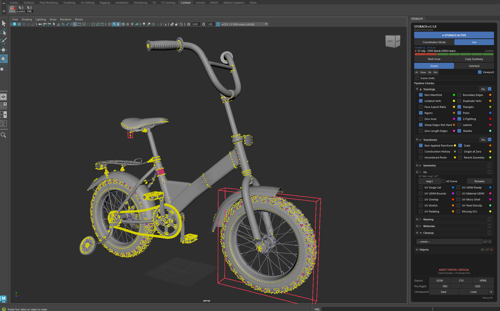

# STUKACH для Maya

Пайплайн-валидатор ассетов для Autodesk Maya. 44 чекера в 7 категориях — топология, трансформации, симметрия, UV, нейминг, материалы, клинап — плюс проверка юнитов сцены, с пофрейсовым оверлеем во вьюпорте, фиксами в один клик и Qt-панелью, которая по умолчанию докится в интерфейс Maya.

Часть системы **STUKACH — Pipeline Asset Validation System**. Blender-версия живёт в [abyrvalg379/STUKACH](https://github.com/abyrvalg379/STUKACH).

*English documentation: [README.md](README.md)*

**Автор:** Maksim Kovalev · **Версия:** 1.1.1 · **Лицензия:** GPL-3.0




## Требования

- Maya 2022+ (PySide2) или Maya 2025+ (PySide6) — собрано и протестировано на Maya 2025
- numpy, scipy (устанавливаются в user site-packages автоматически инсталлятором)
- В комплекте `stukachDrawOverride.mll` собран для **Maya 2025 / Windows x64**. Для других версий Maya скомпилируйте C++-плагин из исходников (см. ниже) — остальной тул работает и без него через fallback на display layers.

## Установка (drag & drop)

1. Скачайте `STUKACH_Maya_v*.zip` со страницы [последнего релиза](https://github.com/abyrvalg379/STUKACH_Maya/releases/latest) и распакуйте.
2. Перетащите `install_stukach.py` во вьюпорт Maya.
3. На полке *Custom* появится кнопка **STUKACH** — клик открывает панель.

Инсталлятор копирует пакет в `Documents/maya/2025/scripts/MAYA_STUKACH/`, плагин — в `Documents/maya/2025/plug-ins/`, и при необходимости ставит numpy/scipy в Maya Python.

## Чекеры (44)

43 проверки в 7 категориях + **Scene Units** (уровень сцены, вне категорийного счёта).

| Категория | # | Проверки |
|---|---|---|
| **Topology** | 14 | non-manifold, boundary edges, isolated verts, duplicate verts, face aspect ratio, triangles, n-gons, poles, zero-area faces, z-fighting, sharp edges not hard, lamina, zero-length edges, starlike |
| **Transforms** | 6 | неприменённые трансформы, неравномерный скейл, construction history, пивот не в нуле, нецентрированные пивоты, parent geometry |
| **Symmetry** | 3 | X / Y / Z (сравнение сеток через numpy) |
| **UV** | 10 | единственный UV-сет, UDIM ready, UDIM bounds, материал на UDIM, UV overlap, UV micro-shell, UV stretch, texel density, UV padding, отсутствующие UV |
| **Naming** | 6 | нейминг объектов, нейминг групп, нумерация материалов, дублирующиеся имена, имена шейпов, цифры в конце имени |
| **Materials** | 3 | суффикс материалов, назначение материалов, отсутствующие текстуры |
| **Cleanup** | 1 | неиспользуемые данные |
| **Scene** | 1 | юниты сцены (линейная единица — метры) |

## Возможности

- **Оверлей во вьюпорте** — пофрейсовые vertex colors (VP2 DrawOverride, C++-плагин) с режимами рёбра/вершины/bbox; при отсутствии плагина — fallback на display layers.
- **Фиксы в один клик** — apply transforms, delete history, merge duplicates и другие, по чеку или по категории.
- **Модель критичности** — BLOCKER / WARNING / INFO, свёртка статуса ассета, pre-flight перед публикацией.
- **Система игноров** — заглушить конкретный чек на конкретном объекте; исключается из всех свёрток.
- **Пресеты** — сохранение/загрузка конфигураций проверок.
- **Отчёты** — экспорт JSON / CSV / HTML.
- **Live-режим** — перевалидация «грязных» объектов каждую секунду; прогрессивная валидация держит Maya отзывчивой на тяжёлых сценах.
- **Checkpoint** — снапшот валидации хранится внутри файла сцены и восстанавливается после переоткрытия.
- **USD pre-flight** — гейтит экспорт так же, как FBX.
- **Журнал сессии и Debug Info** — один клик копирует версии, состояние и свежий лог в буфер для багрепорта.
- **Hot reload** — правишь код, перезапускаешь — панель жива.

## Сборка C++-плагина из исходников

```
cd stukach_draw
mkdir build && cd build
cmake .. -G "Visual Studio 17 2022" -A x64
cmake --build . --config Release
```

Нужны VS 2022 Build Tools + CMake. Готовый `stukachDrawOverride.mll` положите в `Documents/maya/<version>/plug-ins/`.

## Ручная установка

Архитектура и шаги ручной установки — в `MAYA_STUKACH/ARCHITECTURE.md`.
